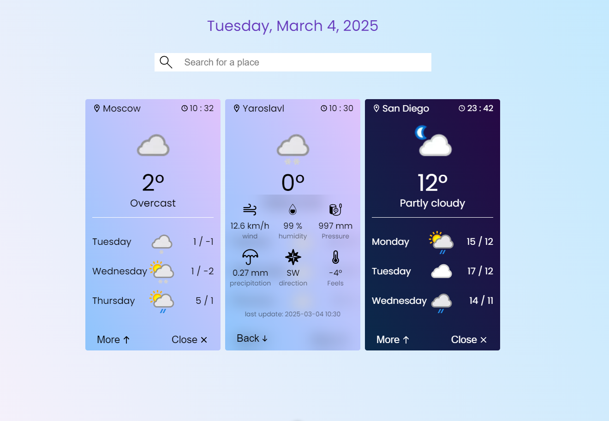

# Vue 3 Expense Tracker

  

Weather app built with Vue 3 and the composition API

  

- Add and remove city

- Check current weather

- Check rofecast for 3 days

- Show expension info

- Save data to local storage


  



  

---

  

## Project Setup

```sh
npm install
```

### Compile and Hot-Reload for Development

```sh
npm run dev
```

### Type-Check, Compile and Minify for Production

```sh
npm run build
```
